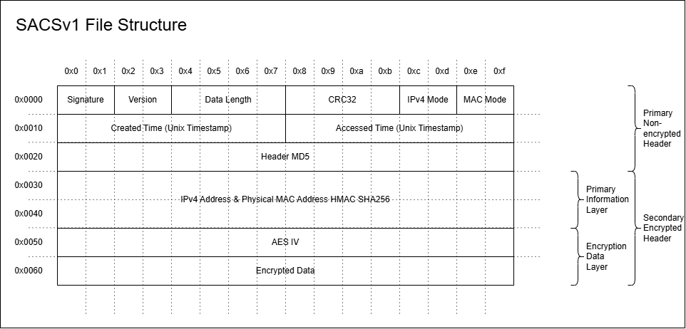

# SACS - Secure Access Control Structure
Present By HATZ Research (@mastermind65535) 
This project is used to demonstrate our security capabilities. 

## Disclaimer
> We assume no responsibility for any vulnerabilities, security incidents, data loss, system failures, or other issues that may arise from the use of this structure.
> The implementation and use of SACS are entirely at the user's own risk, and we strongly recommend conducting proper security measures and validation.
> We shall not be held liable for any legal, financial, or technical consequences resulting from the application of this project.
>
> **We are not responsible for any damage caused by vulnerabilities in this project.**

## SACSv1
The first Primary Information Layer is encrypted using the AES key specified by the user. 
In this case, the IV is generated using the Header MD5, so the IV is highly likely to be randomly assigned. 
The IV is generated by combining the time data, CRC32 checksum data, version information, and data length information. 
This makes it very difficult to guess the IV if the generation principle is unknown. 

This key is used to decrypt the Encryption Data Layer and the doubly encrypted Encrypted Data. 

The Encryption Data Layer contains the file creator's IPv4 address, MAC address, a SHA256 HMAC created using specific dummy data, and the IV used to encrypt the Encrypted Data. 
The Encryption Data Layer uses an address-based encryption system that prevents decryption even if a hacker obtains the creator's AES key. 

If a hacker obtains the user's AES key, but IPv4 Mode and MAC Mode are both enabled, the data remains partially protected. 
The AES key for the Encrypted Data changes depending on whether IPv4 Mode or MAC Mode is activated. 

Below is the AES key generation method for Layer 2: 
- If both IPv4 Mode and MAC Mode are disabled, the creator's HMAC information is used.
- If either IPv4 Mode or MAC Mode is enabled, the activated address information is used.
- If both IPv4 Mode and MAC Mode are enabled, both the IPv4 address and MAC address are used.
  
| Field Name                                       | Bytes            | Instruction |
|--------------------------------------------------|------------------|---------------------------------------------------------------|
| Signature                                        | 2 Bytes          | A unique identifier for the file format                       |
| Version                                          | 2 Bytes          | Indicates the version of the file                             |
| Data Length                                      | 4 Bytes          | Total length of the file data                                 |
| CRC32                                            | 4 Bytes          | CRC32 checksum for header integrity verification              |
| IPv4 Mode                                        | 2 Bytes          | Flag indicating whether an IPv4 address is included           |
| MAC Mode                                         | 2 Bytes          | Flag indicating whether a MAC address is included             |
| Created Time (Unix Timestamp)                    | 8 Bytes          | Timestamp of when the file was created (Unix format)          |
| Accessed Time (Unix Timestamp)                   | 8 Bytes          | Timestamp of when the file was last accessed (Unix format)    |
| Header MD5                                       | 16 Bytes         | MD5 hash for verifying header integrity                       |
| IPv4 Address & Physical MAC Address HMAC SHA256  | 32 Bytes         | HMAC-SHA256 hash of the IPv4 address and physical MAC address |
| AES IV                                           | 16 Bytes         | Initialization Vector (IV) used for AES encryption            |
| Encrypted Data                                   | (Variable Size)  | The actual encrypted data section                             |

## SACS-B
SACS-B is a file structure developed for basic testing purposes of SACS. 
It contains numerous vulnerabilities and is not intended for commercial use or real-world applications. It is merely a reference material designed to aid understanding. 
| Field Name            | Bytes            | Instruction                                                                                 |
|:----------------------|:-----------------|:--------------------------------------------------------------------------------------------|
| Signature             | 2 Bytes          | A unique identifier for the file, set to a specific value (e.g., 0x42 0x6C).                |
| Version               | 2 Bytes          | A version identifier.                                                                       | 
| IPv4 Address          | 4 Bytes          | Indicates the version of the SACS structure for future compatibility. (Limited feature)     |
| Physical MAC Address  | 6 Bytes          | Indicates the version of the SACS structure for future compatibility. (Limited feature)     |
| Header HMAC MD5       | 16 Bytes         | Stores a device's MAC address, restricting access to the authorized machine.                |
| AES IV                | 16 Bytes         | Includes an HMAC-MD5 hash to verify the integrity of the file header.                       |
| Encrypted Data        | (Variable Size)  | The actual encrypted data, protected using AES-256 encryption.                              |

### Vulnerabilities
SACS-B has a vulnerability where accessible IP addresses and MAC addresses are managed in plaintext, and HMAC MD5 is stored in an unprotected location, making it very easy for an attacker to manipulate and access the data. 
Using HxD or other hex editors, it is possible to easily disable device access control solutions, leaving only the final AES-256 security layer. This could allow unauthorized external access and is a very dangerous vulnerability.
