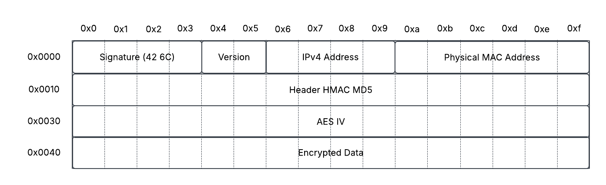

# SACS - Secure Access Control Structure

## Disclaimer
> We assume no responsibility for any vulnerabilities, security incidents, data loss, system failures, or other issues that may arise from the use of this structure.
> The implementation and use of SACS are entirely at the user's own risk, and we strongly recommend conducting proper security measures and validation.
> We shall not be held liable for any legal, financial, or technical consequences resulting from the application of this project.

## SACS-B
SACS-B is a file structure developed for basic testing purposes of SACS. 
It contains numerous vulnerabilities and is not intended for commercial use or real-world applications. It is merely a reference material designed to aid understanding. 
| Field Name            | Bytes            | Instruction                                                                                 |
|:----------------------|:-----------------|:--------------------------------------------------------------------------------------------|
| Signature             | 2 Bytes          | A unique identifier for the file, set to a specific value (e.g., 0x42 0x6C).                |
| IPv4 Address          | 4 Bytes          | Indicates the version of the SACS structure for future compatibility. (Limited feature)     |
| Physical MAC Address  | 6 Bytes          | Indicates the version of the SACS structure for future compatibility. (Limited feature)     |
| Header HMAC MD5       | 16 Bytes         | Stores a device's MAC address, restricting access to the authorized machine.                |
| AES IV                | 16 Bytes         | Includes an HMAC-MD5 hash to verify the integrity of the file header.                       |
| Encrypted Data        | (Variable Size)  | The actual encrypted data, protected using AES-256 encryption.                              |

## SACSv1
On Dev
